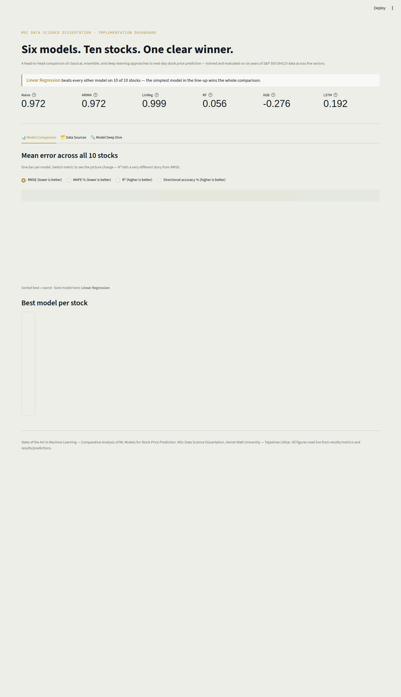
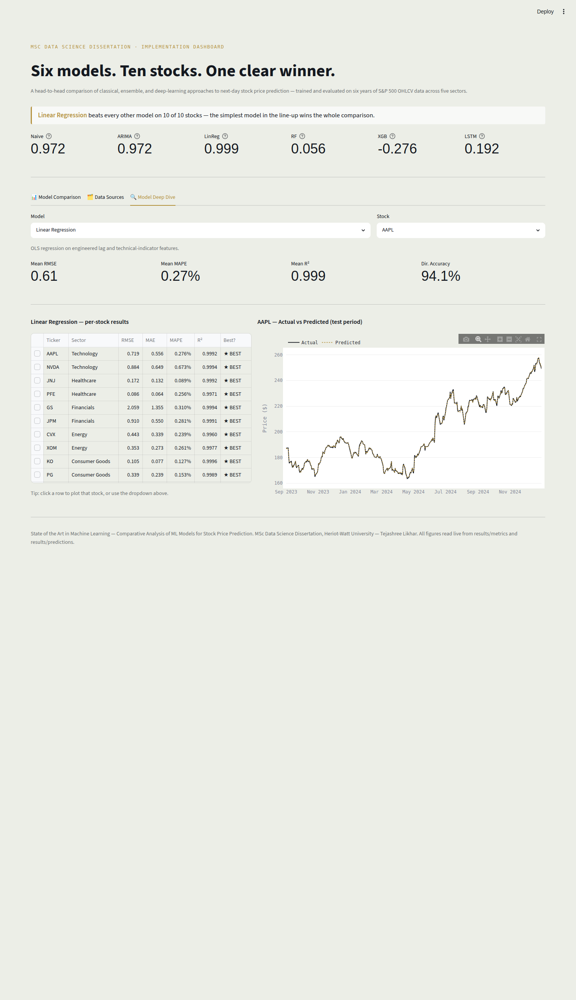
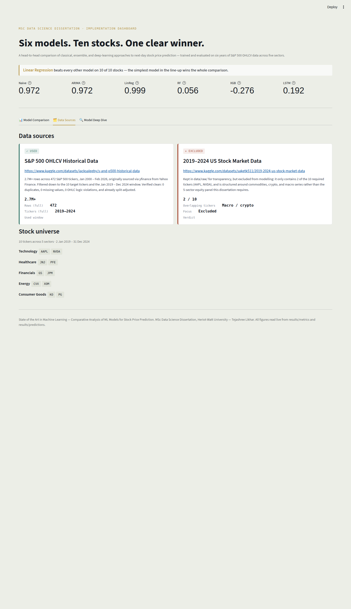

# State of the Art in Machine Learning: Comparative Analysis of ML Models for Stock Price Prediction

MSc Data Science Dissertation Implementation — Tejashree Likhar, Heriot-Watt University

This repository contains the full, tested, and already-executed implementation for the
dissertation. All 6 models (Naive baseline, ARIMA, Linear Regression, Random Forest,
XGBoost, LSTM) have been trained and evaluated on all 10 stocks; results, metrics, and
an interactive Streamlit dashboard are included.

🔗 **[Live Demo](https://state-of-art-in-machine-learning-ktorbdu9j7k7jpsnsdsnea.streamlit.app/)**  

**[ Jump to: Data Sources](#1-data-sources) · [Dashboard](#2-interactive-dashboard) · [Project Structure](#3-project-structure) · [Setup & Run](#4-setup--run) · [Key Results](#5-key-results-summary)**

## 1. Data Sources

### Primary dataset (USED)
**S&P 500 OHLCV Historical Data** (Kaggle)
Link: https://www.kaggle.com/datasets/jacksaleeby/s-and-p500-historical-data
- 2.7M+ rows, 472 S&P 500 tickers, Jan 2000 – Feb 2026, originally sourced via
  `yfinance` from Yahoo Finance.
- Filtered down to our 10 target tickers and the Jan 2019 – Dec 2024 window.
- Found to already be very clean: 0 duplicates, 0 missing values, 0 OHLC logic
  violations, and prices already split-adjusted (verified against NVDA's 2021 4:1
  and 2024 10:1 splits). This is documented honestly in `results/metrics/data_cleaning_report.txt`.

### Secondary dataset (EVALUATED, NOT USED)
**2019-2024 US Stock Market Data** (Kaggle)
Link: https://www.kaggle.com/datasets/saketk511/2019-2024-us-stock-market-data
- Kept in `data/raw/` for transparency, but excluded from modelling because it only
  contains 2 of our 10 required tickers (AAPL, NVDA) and is structured around
  commodities/crypto/macro series rather than the 5-sector equity panel this
  dissertation requires.

### The 10 stocks / 5 sectors used
| Sector | Stocks |
|---|---|
| Technology | AAPL, NVDA |
| Healthcare | JNJ, PFE |
| Financials | JPM, GS |
| Energy | XOM, CVX |
| Consumer Goods | PG, KO |

Date range: **2 Jan 2019 – 31 Dec 2024** (6 calendar years / ~1,461 trading days per
stock). Train/test split: chronological, train ≤ 31 Aug 2023, test ≥ 1 Sep 2023
(≈77/23 split — very close to the 80/20 specified in the requirements).

## 2. Interactive Dashboard

A [Streamlit](https://streamlit.io) app (`streamlit_app/app.py`) presents everything
above plus the full model comparison interactively — good for a live walkthrough or
viva demo. It reads `results/metrics/` and `results/predictions/` directly off disk
(cached in-memory), so there's no separate build/export step: re-run a model script,
refresh the browser, and the dashboard reflects the new numbers.

**Model Comparison** — mean RMSE / MAPE / R² / directional accuracy across all 10
stocks, one horizontal bar per model, sorted best → worst:



**Model Deep Dive** — pick any model and any stock to see its per-stock metrics table
(click a column header to sort, click a row to plot that stock) alongside an
Actual-vs-Predicted line chart:



**Data Sources** tab lays out the primary/secondary dataset decision and the full
10-stock, 5-sector universe:



See [Setup & Run](#4-setup--run) below for how to launch it.

## 3. Project Structure

```
State of Art in Machine Learning/
├── data/
│   ├── raw/                      # Raw extracts (both evaluated data sources)
│   └── processed/                # Cleaned + feature-engineered CSVs (per ticker & combined)
├── src/
│   ├── 01_data_cleaning.py       # Run 1st
│   ├── 02_feature_engineering.py # Run 2nd
│   ├── utils.py                  # Shared functions (import only, don't run directly)
│   └── models/
│       ├── 03_arima_model.py                             # Run 3rd
│       ├── 04_linear_regression_model.py                 # Run 4th
│       ├── 05_random_forest_model.py                     # Run 5th (~20 min, has checkpoint/resume)
│       ├── 06_xgboost_model.py                           # Run 6th  (~8 min, has checkpoint/resume)
│       ├── 07_lstm_model.py                              # Run 7th  (~5 min on CPU, faster on Colab GPU)
│       ├── 08_evaluate_results.py                        # Run 8th - builds all tables & charts
│       └── 09_naive_baseline_and_directional_accuracy.py # Run 9th (LAST)
├── results/
│   ├── metrics/       # All CSVs: per-model metrics, comparison tables, sector summaries
│   ├── predictions/   # Actual vs Predicted CSV for every model x stock (60 files)
│   └── figures/       # All PNG charts (prediction plots, RMSE/MAPE/R2 bar charts, feature importance)
├── streamlit_app/
│   ├── app.py                    # The interactive dashboard (see §2 and §4)
│   ├── requirements.txt          # streamlit, pandas, plotly
│   └── .streamlit/
│       └── config.toml           # Theme (colors/fonts) for the dashboard
├── docs/                         # Dashboard screenshots used in this README
├── requirements.txt              # Deps for the modelling pipeline (src/)
├── .gitignore
└── README.md (this file)
```

## 4. Setup & Run

### 4.1 Modelling pipeline

```bash
python -m venv venv
source venv/bin/activate          # Windows: venv\Scripts\activate
pip install -r requirements.txt

cd src
python 01_data_cleaning.py
python 02_feature_engineering.py
cd models
python 03_arima_model.py
python 04_linear_regression_model.py
python 05_random_forest_model.py     # slowest - grid search, ~20 min total
python 06_xgboost_model.py           # ~8 min total
python 07_lstm_model.py              # ~5 min on CPU; use Colab GPU to go faster (NFR2)
python 08_evaluate_results.py        # generates all comparison tables & charts
python 09_naive_baseline_and_directional_accuracy.py
```

Random Forest and XGBoost scripts have **checkpoint/resume** built in: if interrupted,
just re-run the same script and it will skip tickers already completed.

**Running LSTM on Google Colab (optional, for GPU speed):** upload `src/` and
`data/processed/` to Colab session, `!pip install tensorflow` (usually
pre-installed), then run `07_lstm_model.py` exactly as-is — no code changes needed.

### 4.2 Dashboard (Streamlit)

From the project root, with the modelling pipeline already run at least once (so
`results/metrics/` and `results/predictions/` are populated):

```bash
pip install -r streamlit_app/requirements.txt
streamlit run streamlit_app/app.py
```

This opens the dashboard at `http://localhost:8501`. It only reads from `results/`
and `data/` — it never re-runs or modifies the models.

If you only want to explore the dashboard without setting up the full modelling
environment, `pip install -r streamlit_app/requirements.txt` is the only install you
need, since `results/` is already committed to this repo.

## 5. Key Results Summary (already computed)

Mean performance across all 10 stocks (see `results/metrics/overall_model_summary.csv`):

| Model | RMSE | MAPE | R² |
|---|---|---|---|
| Linear Regression | 0.61 | 0.27% | 0.999 |
| Naive (Prev. Close) | 2.26 | 1.04% | 0.972 |
| ARIMA | 2.28 | 1.05% | 0.972 |
| LSTM | 21.02 | 9.81% | 0.192 |
| Random Forest | 24.20 | 9.09% | 0.056 |
| XGBoost | 26.80 | 11.85% | -0.276 |

**Headline finding:** Linear Regression outperforms every other model on every single
one of the 10 stocks. This directly replicates and extends the finding of AlQahtani et
al. (2025) and Jayanth (2025) cited in the literature review. The tree-based models
(Random Forest, XGBoost) and even LSTM perform very poorly — sometimes with **negative
R²** — specifically on stocks that rallied sharply during the test period (NVDA, JPM,
AAPL, PG), because these models cannot extrapolate beyond the price range seen during
training.

## 6. What's NOT included in this repo
- The full 137MB raw S&P 500 CSV (472 tickers) is excluded for size reasons. `data/raw/00_raw_extract_10stocks.csv` already contains the exact filtered extract that was used.
